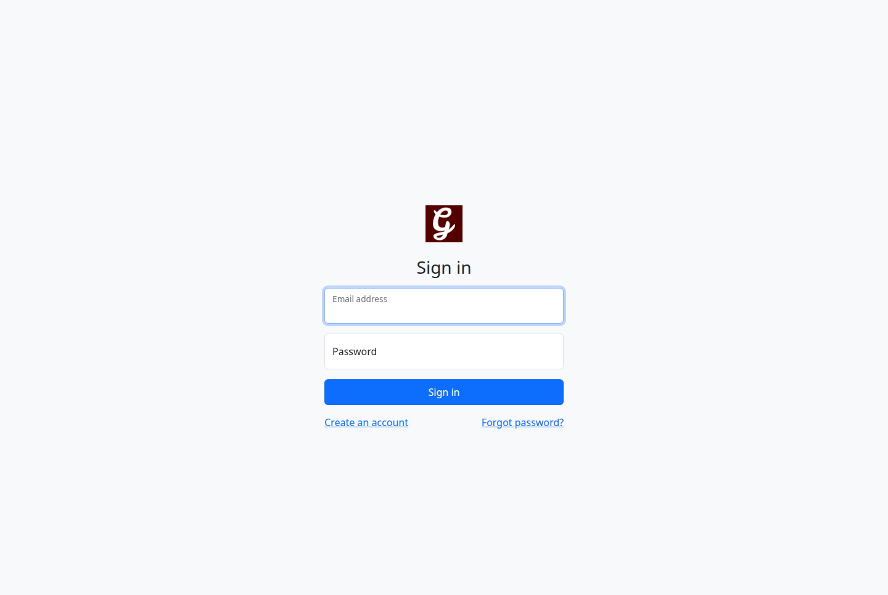
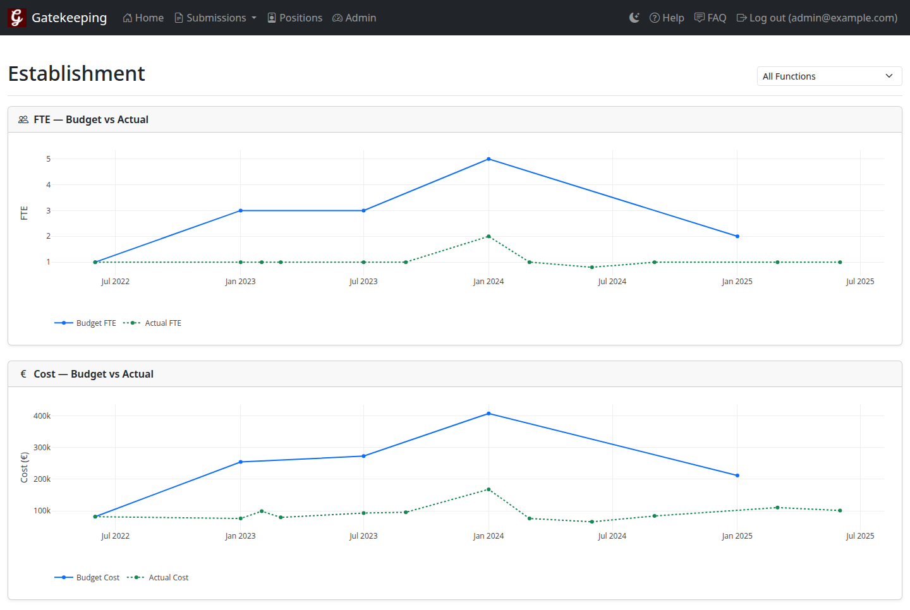
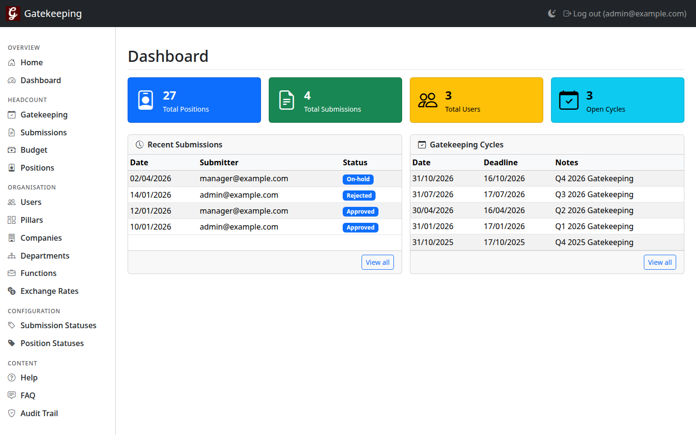
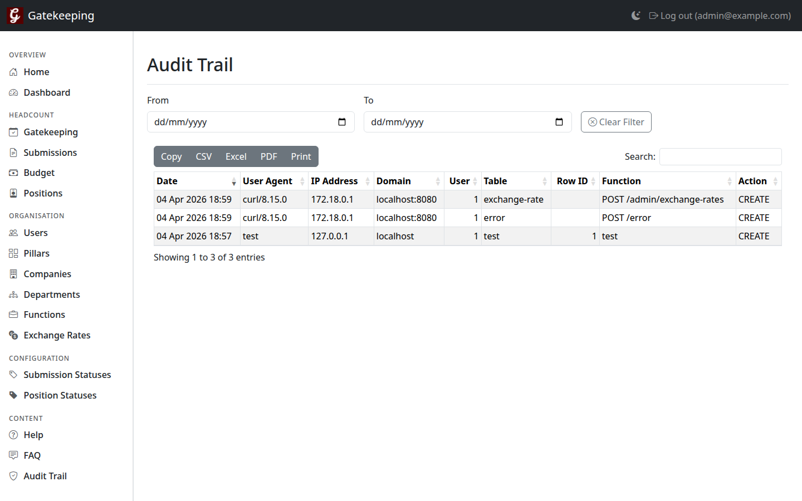
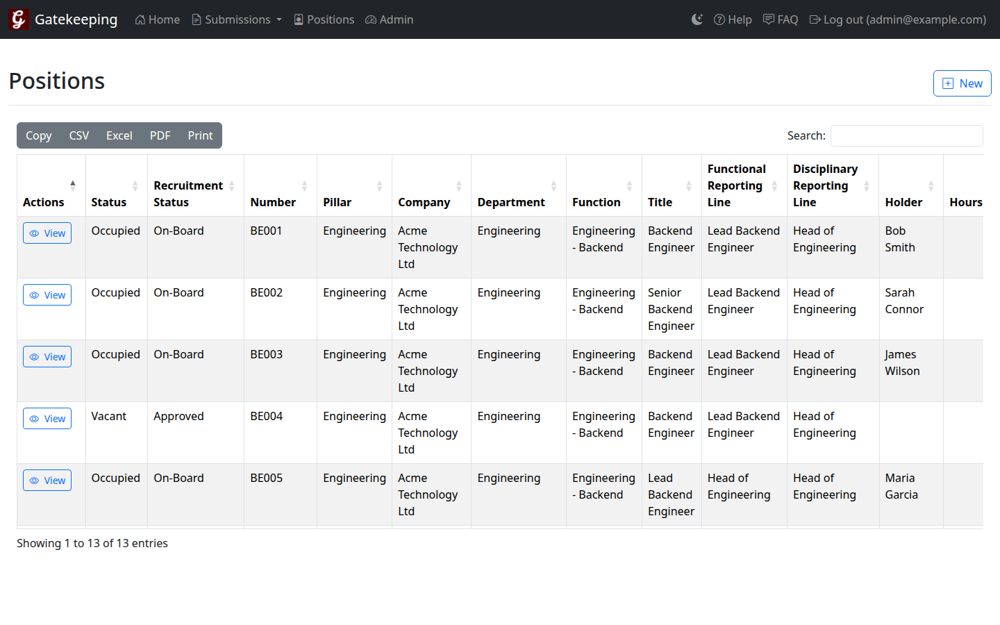
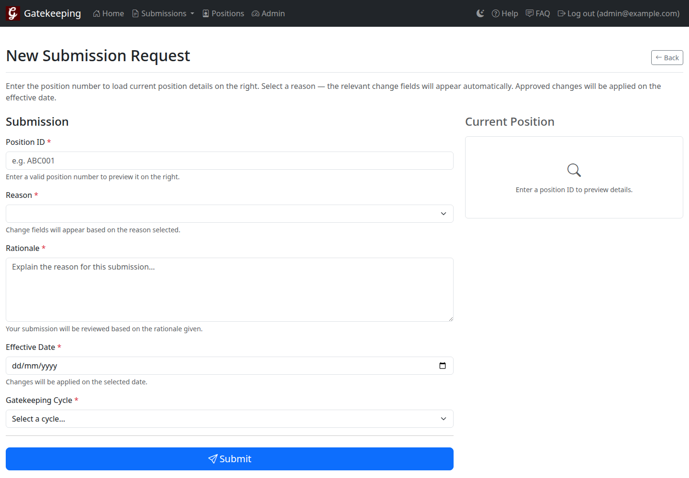

# Gatekeeping — Headcount Planning & Management System

An internal enterprise tool for managing job positions, headcount budgets,
submission/approval workflows, org hierarchy, and analytics dashboards.








---

## Tech Stack

| Layer | Technology |
|-------|-----------|
| Language | Java 21 (LTS) |
| Framework | Spring Boot 3.5.3 |
| Templates | Thymeleaf 3 + Layout Dialect |
| Frontend | Bootstrap 5.3, Alpine.js 3, htmx 2, DataTables 2, Quill 2 |
| Database | PostgreSQL 17 |
| Migrations | Flyway |
| Data access | Spring JDBC (`NamedParameterJdbcTemplate`) — no ORM |
| Security | Spring Security 6 (form login, BCrypt, CSRF, role hierarchy) |
| Email | Spring Mail (SMTP) |
| Scheduling | Spring `@Scheduled` |
| Build | Gradle 8 (Kotlin DSL) |
| Container | Docker + Docker Compose |
| Tests | JUnit 5, Testcontainers, MockMvc, Mockito |

> **Legacy branch:** The original Flask 1.1 / SQLite application is preserved on
> the `master` branch for reference.

---

## Prerequisites

- Java 21+
- Docker & Docker Compose

---

## Quick Start (Docker)

```bash
# Clone the repository and switch to the Spring Boot branch
git clone https://github.com/gabegm/Headcount-Planning-Management-System
cd Headcount-Planning-Management-System
git checkout migration/spring-boot

# Start PostgreSQL + the application
docker compose up --build
```

Open <http://localhost:8080> in a browser.

Default admin credentials (change after first login):

| Field    | Value                                   |
|----------|-----------------------------------------|
| Email    | `gabriel.gaucimaistre@gaucimaistre.com` |
| Password | `changeme`                              |

---

## Local Development

### 1. Start the database

```bash
docker compose up postgres -d
```

### 2. Configure environment

The application reads connection details from environment variables. Copy and
adjust the defaults:

```bash
export DB_URL=jdbc:postgresql://localhost:5432/headcount
export DB_USERNAME=headcount
export DB_PASSWORD=headcount
export MAIL_HOST=localhost
export MAIL_PORT=1025
export MAIL_PASSWORD=
```

Or override via `application.yml` for local use.

### 3. Run the application

```bash
cd app
JAVA_HOME=<path-to-java-21> ./gradlew bootRun
```

Open <http://localhost:8080> in a browser.

---

## Building

```bash
cd app
./gradlew build
```

The fat JAR is produced at `app/build/libs/headcount-*.jar`.

---

## Running Tests

Tests use [Testcontainers](https://testcontainers.com/) — Docker must be
running.

```bash
cd app
./gradlew test
```

Test categories:

| Category | What it covers |
|----------|---------------|
| Repository tests | JDBC queries against a real PostgreSQL container |
| Controller tests | Full HTTP request/response via MockMvc |
| Security tests | Auth, access control, CSRF enforcement |
| Service unit tests | Business logic with Mockito mocks |

---

## Project Structure

```
app/
├── src/main/java/com/gaucimaistre/headcount/
│   ├── config/          # SecurityConfig
│   ├── controller/      # MVC controllers (Auth, Home, Position, Submission, Admin, …)
│   ├── mapper/          # JDBC RowMappers
│   ├── model/           # Java records (domain model) + enums
│   ├── repository/      # JDBC repositories (NamedParameterJdbcTemplate)
│   ├── scheduler/       # @Scheduled background tasks
│   ├── security/        # UserDetails + UserDetailsService
│   └── service/         # Business logic layer
├── src/main/resources/
│   ├── db/migration/    # Flyway V1 (schema) + V2 (seed data)
│   ├── templates/       # Thymeleaf templates
│   │   ├── layout/      # Base layouts (main, admin, auth)
│   │   ├── admin/       # 17 admin pages
│   │   ├── auth/        # Login, register, password reset
│   │   ├── position/    # Position list + detail
│   │   └── submission/  # Submission list, create, change
│   └── static/          # CSS, images
└── src/test/            # Integration + unit tests
```

---

## Configuration Reference

Key properties in `application.yml` (all overridable via environment variables):

| Property | Env var | Default |
|----------|---------|---------|
| `spring.datasource.url` | `DB_URL` | `jdbc:postgresql://localhost:5432/headcount` |
| `spring.datasource.username` | `DB_USERNAME` | `headcount` |
| `spring.datasource.password` | `DB_PASSWORD` | `headcount` |
| `spring.mail.host` | `MAIL_HOST` | `localhost` |
| `spring.mail.port` | `MAIL_PORT` | `1025` |
| `server.servlet.session.timeout` | — | `20m` |
