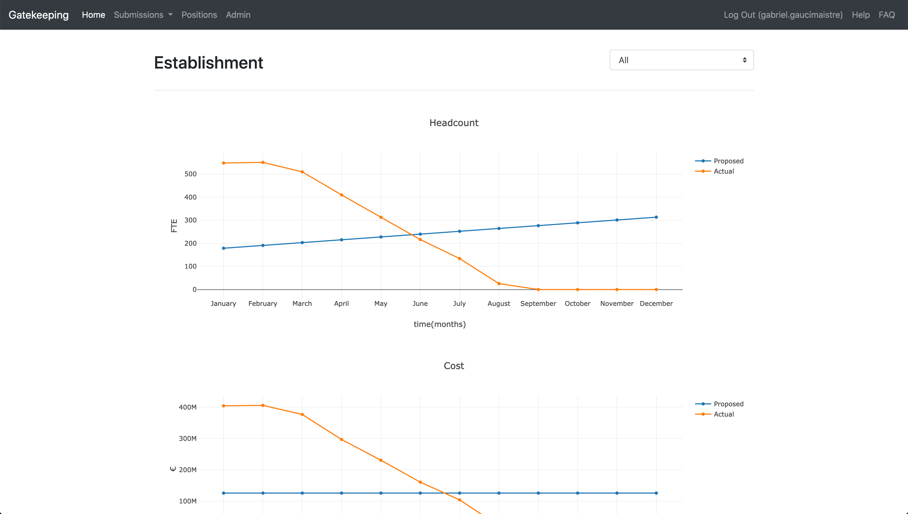
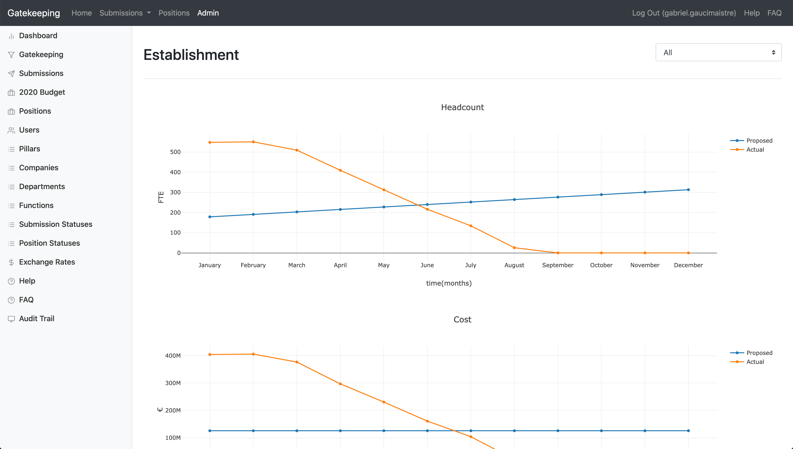
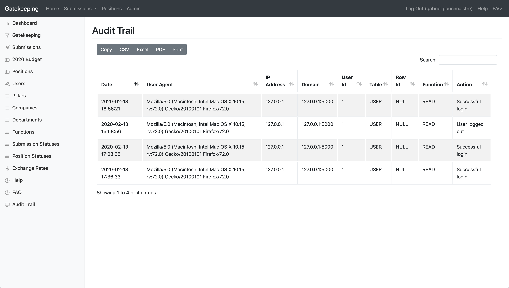
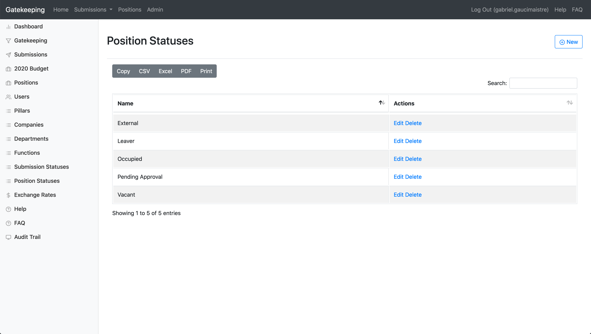
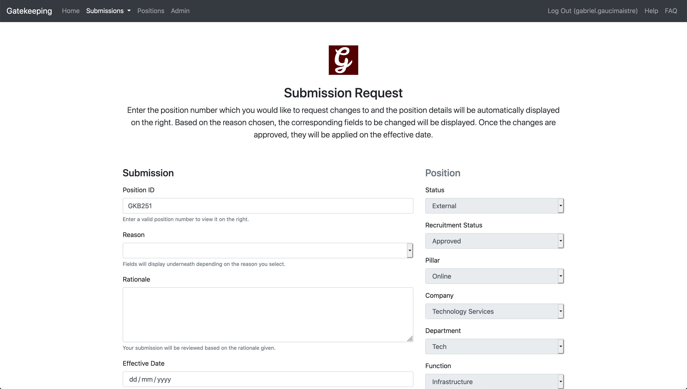

Gatekeeping
======

Gatekeeping Flask app.

Install
-------

**Be sure to use the same version of the code as the version of the docs
you're reading.** You probably want the latest tagged version, but the
default Git version is the master branch. ::

    # clone the repository
    git clone https://github.com/gabegm/gatekeeping
    cd gatekeeping

Create a virtualenv and activate it::

    python -m venv ~/envs/gatekeeping
    source ~/envs/gatekeeping/bin/activate
    pip install -r web/requirements.txt

Add email password::

    echo "mail = ('mail@domain.com', 'pass')" > web/gatekeeping/keys.py

Generate SSL certificate::

    sudo apt-get openssl
    openssl req -x509 -newkey rsa:4096 -nodes -out web/cert.pem -keyout web/key.pem -days 365 && \

Install gatekeeping::

    pip install -e .

Development
---

::

    export FLASK_APP=gatekeeping
    export FLASK_ENV=development
    flask init-db # first run
    flask run

Open <http://127.0.0.1:5000> in a browser.

Test
----

::

    pip install '.[test]'
    pytest

Run with coverage report::

    coverage run -m pytest
    coverage report
    coverage html  # open htmlcov/index.html in a browser

Production
----

::

    export FLASK_APP=gatekeeping
    flask init-db # first run
    gunicorn -w 4 -b 0.0.0.0:5000 'gatekeeping:create_app()'

Open <http://127.0.0.1:5000> in a browser.

Docker
----

::

    docker-compose build --build-arg BUILD_DB=false # true if first run
    docker-compose up

Open <http://127.0.0.1:5000> in a browser.
